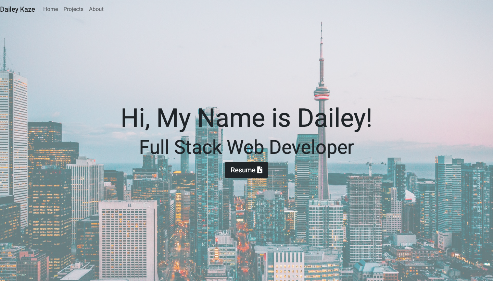

# React-Portfolio

## Description

A personal website with a portfolio of projects with social media links and an about me with React. This website also uses a responsive design to enable rendering on a variety of screen sizes and mobile devices.

## Technologies

* React.js
* HTML
* CSS
* Bootstrap 4
* FontAwesome
* JavaScript

## Goal of the Project

**Create a Responsive Portfolio web application**

In order to ensure the web application is responsive, I used Bootstrap's components and grid layout so that the contents are intact in a variety of screen sizes. To do this, I needed to use relational ratio for positions and widths and heights. In addition, I needed a navigation bar and a footer that was consistent through all pages and would be responsive.

As a portfolio, I needed an "About Me" page with a bio, and image of myself, with links to social media. I have also included a "Portfolio page" with links to past projects, and a "Contact" page with a contact form.

## Usage
The following image is an example of the web application's appearance and functionality:

## URL

See the web application [here](https://scaredofseagles.github.io/React-Portfolio/)

## License

MIT License

Copyright (c) 2020 Dailey Kaze

Permission is hereby granted, free of charge, to any person obtaining a copy
of this software and associated documentation files (the "Software"), to deal
in the Software without restriction, including without limitation the rights
to use, copy, modify, merge, publish, distribute, sublicense, and/or sell
copies of the Software, and to permit persons to whom the Software is
furnished to do so, subject to the following conditions:

The above copyright notice and this permission notice shall be included in all
copies or substantial portions of the Software.

THE SOFTWARE IS PROVIDED "AS IS", WITHOUT WARRANTY OF ANY KIND, EXPRESS OR
IMPLIED, INCLUDING BUT NOT LIMITED TO THE WARRANTIES OF MERCHANTABILITY,
FITNESS FOR A PARTICULAR PURPOSE AND NONINFRINGEMENT. IN NO EVENT SHALL THE
AUTHORS OR COPYRIGHT HOLDERS BE LIABLE FOR ANY CLAIM, DAMAGES OR OTHER
LIABILITY, WHETHER IN AN ACTION OF CONTRACT, TORT OR OTHERWISE, ARISING FROM,
OUT OF OR IN CONNECTION WITH THE SOFTWARE OR THE USE OR OTHER DEALINGS IN THE
SOFTWARE.
